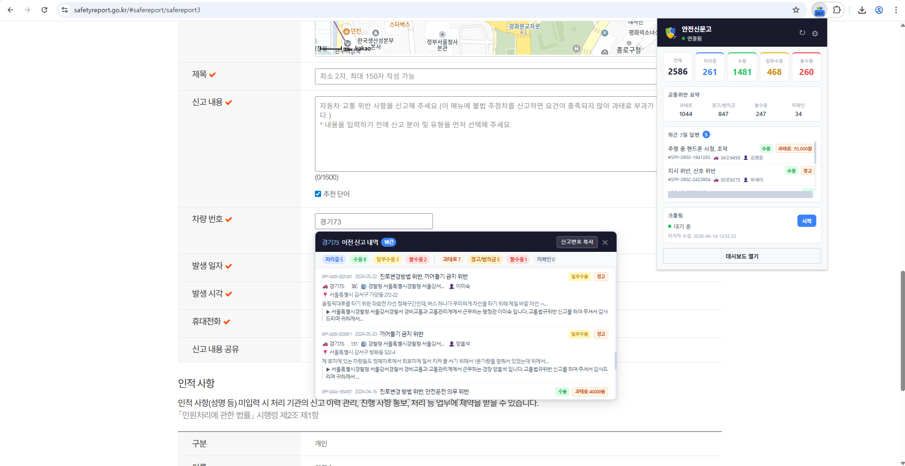

# 나만의 안전신문고 — Chrome 확장

안전신문고 민원 처리 현황을 Chrome 브라우저에서 바로 확인할 수 있는 확장 프로그램입니다.  
[나만의 안전신문고 서버](https://github.com/Fentanest/safetyreport)와 연동하여 동작합니다.

---

## 주요 기능

- **현황 요약** — 팝업에서 전체·처리중·수용·불수용 건수 한눈에 확인
- **교통위반 요약** — 과태료·범칙금·불수용·미확인 건수 표시
- **최근 3일 답변** — 최근에 처리된 신고 목록 빠르게 확인
- **크롤링 제어** — 팝업에서 바로 크롤링 시작·중지
- **차량번호 / 주소 검색** — 안전신문고 사이트 접속 시 차량번호와 주소를 서버 DB에서 즉시 검색
- **변경 알림** — 일반 신고 변경뿐 아니라 중복 신고 변경도 브라우저 알림으로 확인
- **대시보드 바로가기** — 서버 웹 대시보드를 새 탭으로 열기

---

## 설치

[Chrome 웹 스토어](https://chromewebstore.google.com/detail/%EB%82%98%EB%A7%8C%EC%9D%98-%EC%95%88%EC%A0%84%EC%8B%A0%EB%AC%B8%EA%B3%A0/pfoigdedcddegilmjmgojohalkighpgh)에서 바로 설치할 수 있습니다.

---

## 설정

1. 확장 아이콘 클릭 후 우측 상단 **설정(⚙)** 버튼 클릭
2. **서버 주소** 입력 (예: `http://192.168.1.100:6819`)
3. **API 키** 입력 — 서버 웹 UI의 **기기 연동** 페이지에서 발급
4. 필요하면 **크롤링 완료 알림** 여부와 **상태 확인 주기**도 조정
5. **저장** 클릭 → 팝업에서 연결 상태 확인

---

## 차량번호 / 주소 검색

[안전신문고 사이트](https://www.safetyreport.go.kr) 접속 시 페이지 우측 하단에 검색 버튼이 표시됩니다.  
차량번호를 입력하면 서버 DB에서 해당 차량의 신고 이력을, 주소를 입력하면 해당 위치의 신고 이력을 조회할 수 있습니다.

---

## 알림

- 크롤링 완료 시 변경된 신고 수를 브라우저 알림으로 확인할 수 있습니다.
- 중복 신고 관리 기준으로 새 중복군이 생기거나 대표건이 바뀐 경우도 별도 알림으로 표시됩니다.

---

## 연관 프로젝트

- [safetyreport](https://github.com/Fentanest/safetyreport) — 서버 (FastAPI + Selenium)
- [safetyreport-mobile](https://github.com/Fentanest/safetyreport-mobile) — Android 앱
